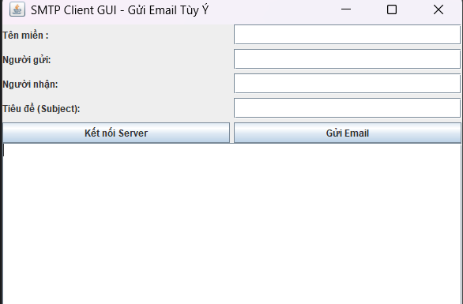
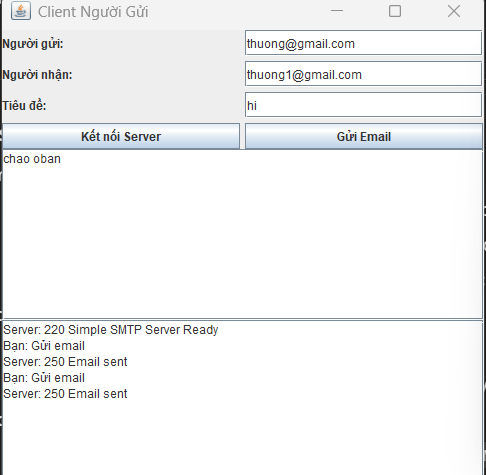
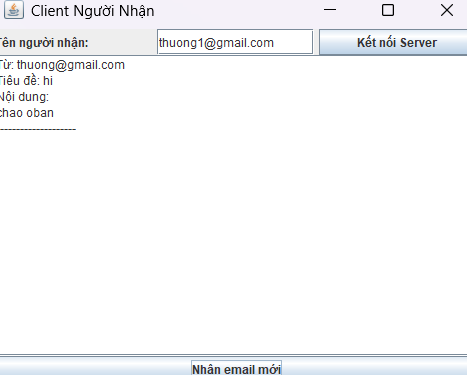

<h2 align="center">
    <a href="https://dainam.edu.vn/vi/khoa-cong-nghe-thong-tin">
    🎓 Faculty of Information Technology (DaiNam University)
    </a>
</h2>>
<h2 align="center">
   Gửi email mô phỏng SMTP qua Socket
</h2>
<div align="center">
    <p align="center">
        
        
        
    </p>

[](https://www.facebook.com/DNUAIoTLab)
[](https://dainam.edu.vn/vi/khoa-cong-nghe-thong-tin)
[](https://dainam.edu.vn)

</div>

## 📖 1. Giới thiệu
Tên đề tài: Gửi email mô phỏng SMTP qua Socket
Mục tiêu:
Hiểu cơ chế hoạt động cơ bản của giao thức SMTP.
Thực hành lập trình Socket trong Java để mô phỏng quá trình gửi/nhận email.
Xây dựng mô hình Client – Server đơn giản:
Client: gửi lệnh SMTP và nội dung email.
Server: phản hồi các mã trạng thái, lưu và hiển thị email.
Ý nghĩa:
Sinh viên nắm được cách thức hoạt động của các giao thức tầng ứng dụng.
Ứng dụng được vào các bài toán lập trình mạng nâng cao (xây dựng mail relay, bảo mật bằng TLS, xác thực tài khoản…).

Thành phần hệ thống
**Khởi động chương trình**
   - Hiển thị menu hướng dẫn nhập lệnh từng bước.

**Gửi lệnh HELO**
   - Người dùng nhập tên → gửi `HELO <tên>` đến Server.
   - Nhận phản hồi `250 Hello <tên>`.

**Gửi lệnh MAIL FROM**
   - Người dùng nhập email người gửi.
   - Gửi `MAIL FROM:<email>`.
   - Nhận phản hồi từ Server.

**Gửi lệnh RCPT TO**
   - Người dùng nhập email người nhận.
   - Gửi `RCPT TO:<email>`.
   - Nhận phản hồi từ Server.

**Gửi lệnh DATA + nội dung email**
   - Client gửi `DATA`.
   - Sau đó cho phép người dùng nhập nhiều dòng nội dung.
   - Kết thúc khi người dùng nhập dấu `.`.

**Gửi lệnh QUIT**
   - Client gửi `QUIT`.
   - Nhận phản hồi `221 Bye`.
   - Hiển thị:  
     ```
     ✅ Phiên SMTP đã kết thúc.
     ```

---

## 🛠️ 2. Công nghệ sử dụng
- Ngôn ngữ lập trình: Java 23 SE
- Thư viện:
java.net.ServerSocket, java.net.Socket (xử lý TCP).
BufferedReader, PrintWriter (gửi/nhận dữ liệu dạng text).
-Giao thức: SMTP (Simple Mail Transfer Protocol).
-Công cụ IDE: Eclipse / IntelliJ IDEA.
-Môi trường chạy: Windows / Linux / macOS.

## 🚀 3. Hình ảnh các chức năng




## ⚙️ 4. Các bước cài đặt & Chạy ứng dụng
🛠️ 4.1. Yêu cầu hệ thống

Máy bạn cần có Java >17 (hoặc Java 8+ cũng được).
IDE: Eclipse, IntelliJ IDEA, hoặc chạy trực tiếp bằng cmd/terminal.

📥 4.2. Các bước chạy chương trình

1. Chạy Server

Mở terminal / IDE, chạy class server:

java LTM.SMTPServerTCP


Terminal sẽ hiển thị:

Server đang chạy trên cổng 9999


Server đã sẵn sàng nhận kết nối từ client.

2. Chạy client Người Nhận (Receiver)

Mở ClientGuiReceiver:

java LTM.ClientGuiReceiver


GUI xuất hiện với:

Ô nhập Tên người nhận

Nút Kết nối Server

Nút Nhận email mới

Ô log hiển thị email

Nhập tên người nhận, ví dụ: hung → nhấn Kết nối Server

Client sẽ đăng ký với server để nhận email push.

3. Chạy client Người Gửi (Sender)

Mở ClientGuiSenderTCP:

java LTM.ClientGuiSenderTCP


GUI xuất hiện với:

Ô nhập Người gửi

Ô nhập Người nhận

Ô nhập Tiêu đề

Ô nhập Nội dung

Nút Kết nối Server

Nút Gửi Email

Nhập thông tin email:

Người gửi: thang

Người nhận: hung (trùng tên client nhận)

Tiêu đề: Test Email

Nội dung: Hello, đây là email demo.

Nhấn Kết nối Server → sau đó nhấn Gửi Email

Server lưu email vào folder emails.

Nếu người nhận online → email được push vào emailList của client nhận.

4. Nhận email trên client Người Nhận

Trên client Người Nhận, nhấn Nhận email mới

GUI sẽ hiển thị nội dung email vừa nhận vào ô log.

Email đã hiển thị → được xóa khỏi danh sách email mới

✅ Lưu ý:

Mỗi client phải kết nối server trước khi gửi/nhận email.

Tên người nhận phải trùng với client đã đăng ký để push notification hoạt động.

Có thể chạy nhiều client Người Nhận cùng lúc → server push email tới từng client tương ứng.

##📞 5. Liên hệ

Email: ducthuong246ss@gmail.com

GitHub: ducthuong11

© 2025 AIoTLab, Faculty of Information Technology, DaiNam University. All rights reserved.